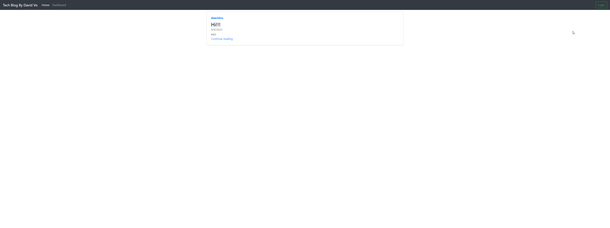

# Tech Blog

  

-----------------------

## Technology Used 🖥️

| Technology Used         | Resource URL           | 
| ------------- |:-------------:| 
| JavaScript | [https://developer.mozilla.org/en-US/docs/Web/JavaScript](https://developer.mozilla.org/en-US/docs/Web/JavaScript)     |  
| node.js | [https://nodejs.org/en](https://nodejs.org/en)     |     
| Express.js | [https://expressjs.com/](https://expressjs.com/)     |     
| Sequelize | [https://sequelize.org/](https://sequelize.org/)     |     
| dotenv | [https://www.npmjs.com/package/dotenv](https://www.npmjs.com/package/dotenv)     |     
| mysql2 | [https://www.npmjs.com/package/mysql2](https://www.npmjs.com/package/mysql2)     | 
| bcrypt | [https://www.npmjs.com/package/bcrypt](https://www.npmjs.com/package/bcrypt)     |   
| Connect-Session-Sequelize | [https://www.npmjs.com/package/connect-session-sequelize](https://www.npmjs.com/package/connect-session-sequelize)     |   
| Express-Handlebars | [https://www.npmjs.com/package/express-handlebars](https://www.npmjs.com/package/express-handlebars)     |   
| Express-Session | [https://www.npmjs.com/package/express-session](https://www.npmjs.com/package/express-session)     |   
| Faker | [https://fakerjs.dev/](https://fakerjs.dev/)     |   
| nodemon | [https://www.npmjs.com/package/nodemon](https://www.npmjs.com/package/nodemon)     |   
| Path | [https://www.npmjs.com/package/path](https://www.npmjs.com/package/path)     |   
| Git | [https://git-scm.com/](https://git-scm.com/)     |   

-------------------

## Description 📝

Talk tech with your friends and build a community!

Find out what's trending in the industry and see all the latest news about machine learning, artificial intelligence, and many more topics.

This application is a MVC-style forum that's powered by:
 
**Sequelize**
- Used to connect to the MySQL database and create tables and columns in JavaScript

**Express**
- Route handling

**MySQL2**
- Used to store information

**Handlebars**
- Rendering Engine

**Faker**
- Used to create fake user information

**Express-Session**
- Used to save cookies and track information across multiple different pages

**bcrypt**
- Used to hash passwords for users to ensure privacy in our database

-----------------------

## Table of Contents 📋
* [Installation Instructions](#installation-instructions-📥)
* [Usage Information](#usage-information-✅)
* [Contribution Guidelines](#contribution-guidelines-🤝)
* [Test Instructions](#test-instructions-🧪)
* [Author Info](#author-info-👺)
* [Questions?](#questions-❓)
* [License](#license-🚩)

----------------------

## Installation Instructions 📥

To install this app on your local machine, follow the instructions below:

1. Make sure you have node.js on your computer
2. Download or clone the contents of this repo on to your local machine
3. Open your integrated terminal in the root directory of this app
4. Run `npm i` to download all of the dependencies
5. Create a `.env` file in the root directory and make DB_NAME, DB_USER, and DB_PASS variables where DB_NAME=blog_db
6. Run the `db/schema.sql` in your MySQL interface

------------------------

## Usage Information ✅

To use the app, follow the steps below:

**Starting the app locally**
1. Once you have all of the dependencies, run `npm run seed` to seed the database with information
2. Run `npm start` in your terminal to start the server
3. Visit `http://localhost:8080/` in your browser

**Signing up/Logging in**
1. In the upper right, click on the green "Login" button
2. Either sign up or log in if you already have an account
3. Once you have signed up, log in.

**Adding a post**
1. Click on `Dashboard` in on the nav bar
2. Click on `Create Post` in the dashboard
3. Fill in your blog post information
4. Click `Create`

**Commenting**
1. Visit a post
2. Fill in your comment in the comment box
3. Click on `Create`

Alternatively, you can also visit: [https://daevidvo-tech-blog.herokuapp.com/](https://daevidvo-tech-blog.herokuapp.com/)

------------------------

## Author Info 👺

### ***daevidvo***
* [Github](https://www.github.com/daevidvo)
* [LinkedIn](https://www.linkedin.com/in/daevidvo)
* [Instagram](https://www.instagram.com/daevidvo)

--------------------------

## Questions ❓

Email me at: [daevidvo@gmail.com](mailto:daevidvo@gmail.com) or [visit my GitHub](github.com/daevidvo)

------------------------

<!-- fix edit posts -->

## License 🚩

https://opensource.org/licenses/MIT

The MIT License (MIT)
=====================

Copyright © daevidvo

Permission is hereby granted, free of charge, to any person
obtaining a copy of this software and associated documentation
files (the “Software”), to deal in the Software without
restriction, including without limitation the rights to use,
copy, modify, merge, publish, distribute, sublicense, and/or sell
copies of the Software, and to permit persons to whom the
Software is furnished to do so, subject to the following
conditions:

The above copyright notice and this permission notice shall be
included in all copies or substantial portions of the Software.

THE SOFTWARE IS PROVIDED “AS IS”, WITHOUT WARRANTY OF ANY KIND,
EXPRESS OR IMPLIED, INCLUDING BUT NOT LIMITED TO THE WARRANTIES
OF MERCHANTABILITY, FITNESS FOR A PARTICULAR PURPOSE AND
NONINFRINGEMENT. IN NO EVENT SHALL THE AUTHORS OR COPYRIGHT
HOLDERS BE LIABLE FOR ANY CLAIM, DAMAGES OR OTHER LIABILITY,
WHETHER IN AN ACTION OF CONTRACT, TORT OR OTHERWISE, ARISING
FROM, OUT OF OR IN CONNECTION WITH THE SOFTWARE OR THE USE OR
OTHER DEALINGS IN THE SOFTWARE.
